# Panduan Penggunaan
## Sistem Analisis Sentimen Aset Kripto Berbasis Ekstraksi Fitur SBERT dan Support Vector Machine dengan Visualisasi Dasbor Interaktif

**Mata Kuliah**: Pemrosesan Teks

**Dosen Pengampu**:
- Ulfa Siti Nuraini, S.Stat., M.Stat.
- Dr. Dian Handayani, M.Si.

---

## Daftar Isi
1. [Persyaratan Sistem](#1-persyaratan-sistem)
2. [Instalasi](#2-instalasi)
3. [Struktur Direktori](#3-struktur-direktori)
4. [Modul 1: Scraping Data](#4-modul-1-scraping-data)
5. [Modul 2: Pra-pemrosesan Teks](#5-modul-2-pra-pemrosesan-teks)
6. [Modul 3: Pelabelan Data](#6-modul-3-pelabelan-data)
7. [Modul 4: Pelatihan Model](#7-modul-4-pelatihan-model)
8. [Modul 5: Dasbor Interaktif](#8-modul-5-dasbor-interaktif)
9. [Pemecahan Masalah](#9-pemecahan-masalah)
10. [Lisensi](#10-lisensi)

---

## 1. Persyaratan Sistem

### Perangkat Keras Minimum
- **Prosesor**: Intel Core i5 atau setara
- **RAM**: Minimal 8 GB (disarankan 16 GB untuk pelatihan model)
- **Penyimpanan**: Minimal 5 GB ruang kosong
- **Koneksi Internet**: Diperlukan untuk scraping data dan akses API

### Perangkat Lunak
- **Sistem Operasi**: Windows 10/11, macOS, atau Linux
- **Python**: Versi 3.13 atau lebih baru
- **Jupyter Notebook/Google Colab**: Untuk menjalankan notebook
- **Web Browser**: Google Chrome, Firefox, atau Edge (versi terbaru)
- **Git**: Untuk mengunduh repositori (opsional)

### Akun dan Kredensial yang Diperlukan
| Akun | Kegunaan | Cara Mendapatkan |
|------|----------|------------------|
| Google Cloud Console | API Key YouTube | https://console.cloud.google.com |
| Google AI Studio | API Key Gemini | https://aistudio.google.com |
| Akun X (Twitter) | Cookies untuk scraping | Login di browser |

> **Catatan**: Kuota API dapat berubah sewaktu-waktu. Disarankan untuk selalu mengecek langsung ke provider terkait (Google Cloud Console, Google AI Studio) untuk informasi kuota terbaru.

---

## 2. Instalasi

### Langkah 2.1: Unduh Repositori
Unduh atau clone repositori proyek dari GitHub.

```bash
git clone https://github.com/alfathir27/pemteks-final-project.git
cd pemteks-final-project
```

Atau unduh langsung sebagai ZIP dari: https://github.com/alfathir27/pemteks-final-project

### Langkah 2.2: Membuat Virtual Environment per Modul
**Disarankan** membuat virtual environment terpisah untuk setiap modul guna menghindari konflik dependensi.

```bash
# Contoh: Membuat venv untuk Modul Scraping
python -m venv venv

# Mengaktifkan virtual environment
# Untuk Windows:
venv\Scripts\activate

# Untuk macOS/Linux:
source venv/bin/activate
```

**Ulangi langkah di atas untuk setiap modul dengan nama folder berbeda**, contoh:
- `venv-scraping` untuk Modul 1
- `venv-labeling` untuk Modul 3
- `venv-dashboard` untuk Modul 5

### Langkah 2.3: Instalasi Dependensi per Modul
Setiap modul memiliki file `requirements.txt` tersendiri. **Pastikan venv yang sesuai sudah aktif** sebelum menginstal.

```bash
# Aktifkan venv modul yang sesuai, lalu instal
# Contoh untuk Modul Scraping:
cd "01. Scraping"
pip install -r requirements.txt

# Contoh untuk Modul Pelabelan:
cd "03. Labeling"
pip install -r requirements.txt

# Contoh untuk Modul Dasbor:
cd "05. Implementasi Dasbor"
pip install -r requirements.txt
```

---

## 3. Struktur Direktori

```
Project SC/
├── 01. Scraping/                    # Modul ekstraksi data
│   ├── Scraping YouTube.ipynb       # Notebook scraping YouTube
│   ├── scrappingx.py                # Script scraping X (Twitter)
│   └── requirements.txt
│
├── 02. Pra-pemrosesan/              # Modul pembersihan data
│   └── preprocess_X.ipynb           # Notebook pra-pemrosesan
│
├── 03. Labeling/                    # Modul pelabelan otomatis
│   ├── process.py                   # Script pelabelan dengan Gemini
│   ├── newdata-5.csv                # Data input
│   ├── newdata-5-out.csv            # Data output berlabel
│   └── requirements.txt
│
├── 04. Training Model/              # Modul pelatihan model
│   └── [Pemteks]_Analisis_Sentiment.ipynb
│
├── 05. Implementasi Dasbor/         # Modul aplikasi web
│   ├── server.py                    # Backend FastAPI
│   ├── static/
│   │   ├── index.html               # Halaman utama
│   │   ├── style.css                # Styling
│   │   ├── script.js                # Logika frontend
│   │   └── data_dashboard_final.csv # Data sentimen
│   └── requirements.txt
│
├── README.md
├── PANDUAN.md                       # Dokumen ini
└── LICENSE.md
```

---

## 4. Modul 1: Scraping Data

Modul ini berfungsi untuk mengekstrak data komentar dan opini dari platform X (Twitter) dan YouTube.

### 4.1 Scraping Data dari X (Twitter)

#### Langkah 4.1.1: Mendapatkan Cookies
1. Buka browser dan login ke akun X (Twitter)
2. Buka Developer Tools (tekan `F12`)
3. Pilih tab **Application** → **Cookies** → **https://x.com**
4. Catat nilai dari:
   - `auth_token`
   - `ct0`

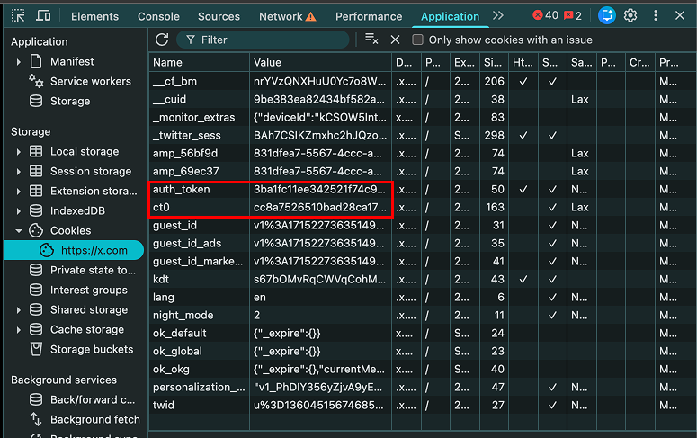

#### Langkah 4.1.2: Konfigurasi Script
Buka file `01. Scraping/scrappingx.py` dan isi kredensial:

```python
# --- KONFIGURASI ---
AUTH_TOKEN = 'masukkan_auth_token_anda'
CT0 = 'masukkan_ct0_anda'

TWEET_PER_BULAN = 300  # Jumlah tweet per bulan yang diambil

TARGET_BULAN = [
    ('2025-01-01', '2025-01-30'),
    ('2025-02-01', '2025-02-28'),
    # Tambahkan periode lainnya sesuai kebutuhan
]
```

#### Langkah 4.1.3: Menjalankan Script
```bash
cd "01. Scraping"
python scrappingx.py
```

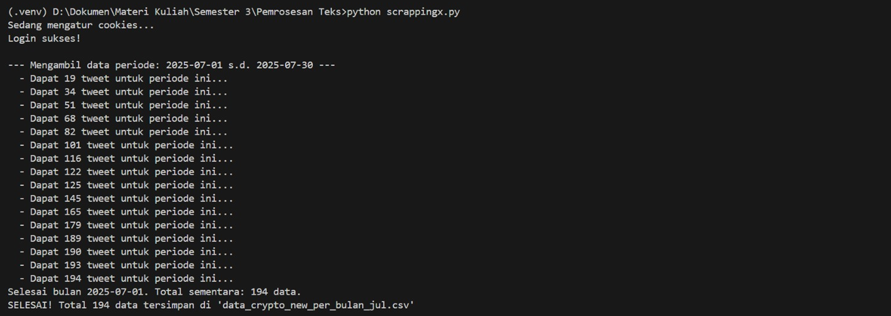

#### Langkah 4.1.4: Hasil Output
File CSV akan dihasilkan dengan kolom:
- `username`: Nama pengguna
- `text`: Isi tweet
- `created_at`: Tanggal posting
- `likes`: Jumlah like
- `retweets`: Jumlah retweet

---

### 4.2 Scraping Data dari YouTube

#### Langkah 4.2.1: Mendapatkan API Key YouTube
1. Buka [Google Cloud Console](https://console.cloud.google.com)
2. Buat project baru atau pilih project yang ada
3. Aktifkan **YouTube Data API v3**
4. Buat kredensial → API Key
5. Isi formulir pembuatan API Key
6. Salin API Key yang dihasilkan

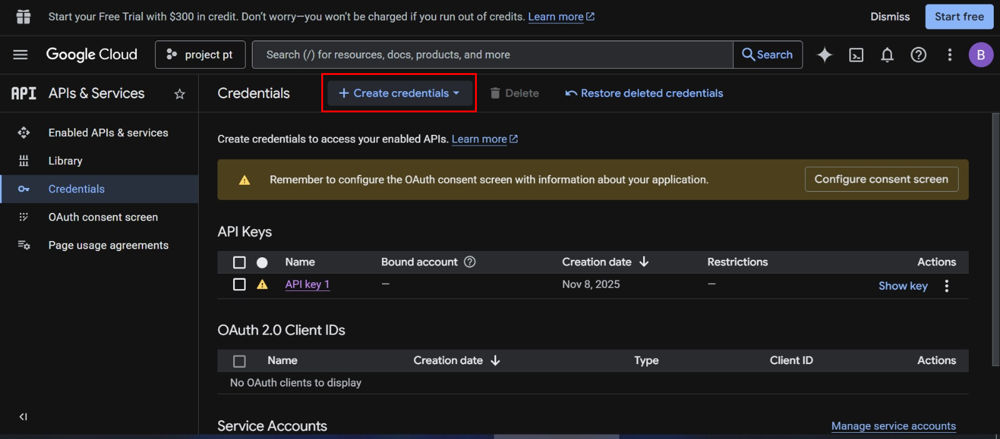
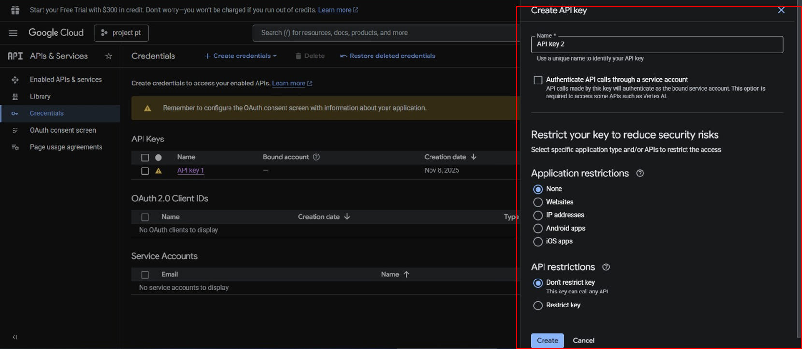

#### Langkah 4.2.2: Menjalankan Notebook
1. Buka file `01. Scraping/Scraping YouTube.ipynb` menggunakan Jupyter Notebook atau Google Colab
2. Masukkan API Key pada sel yang disediakan
3. Jalankan semua sel secara berurutan

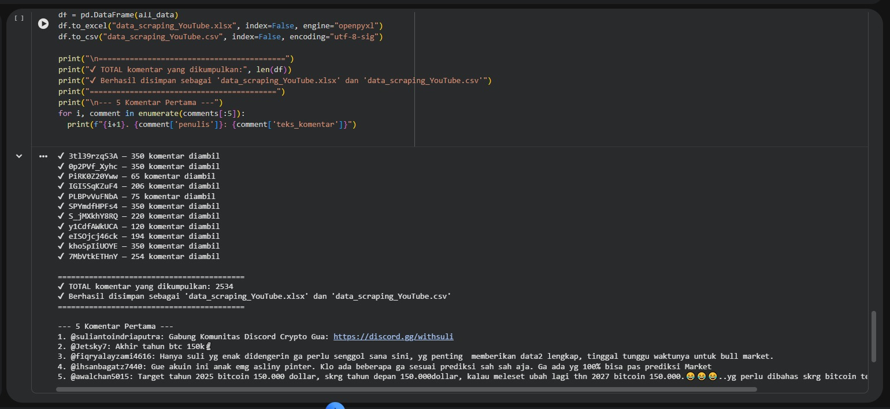

---

## 5. Modul 2: Pra-pemrosesan Teks

Modul ini melakukan pembersihan dan normalisasi data teks mentah.

### Langkah 5.1: Membuka Notebook
Buka file `02. Pra-pemrosesan/preprocess_X.ipynb` menggunakan Jupyter Notebook atau Google Colab.

### Langkah 5.2: Tahapan Pra-pemrosesan
Notebook akan melakukan proses berikut secara otomatis:

| No | Proses | Deskripsi |
|----|--------|-----------|
| 1 | Case Folding | Mengubah semua teks menjadi huruf kecil |
| 2 | Cleaning | Menghapus URL, mention, hashtag, dan karakter khusus |
| 3 | Normalisasi | Mengubah kata-kata slang ke bentuk baku |
| 4 | Tokenisasi | Memecah kalimat menjadi token kata |
| 5 | Stopword Removal | Menghapus kata-kata umum yang tidak bermakna |

### Langkah 5.3: Menjalankan Notebook
1. Pastikan file data hasil scraping sudah tersedia
2. Sesuaikan path input file pada notebook
3. Jalankan semua sel secara berurutan
4. Hasil pra-pemrosesan akan disimpan sebagai file CSV baru

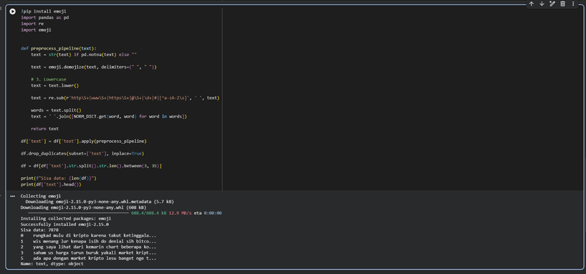

---

## 6. Modul 3: Pelabelan Data

Modul ini menggunakan Large Language Model (LLM) Google Gemini untuk melabeli sentimen data secara otomatis.

### Langkah 6.1: Mendapatkan API Key Gemini
1. Buka [Google AI Studio](https://aistudio.google.com)
2. Login dengan akun Google
3. Klik **API Key** → **Create API Key**
4. Isi form yang dibutuhkan
5. Salin API Key yang dihasilkan

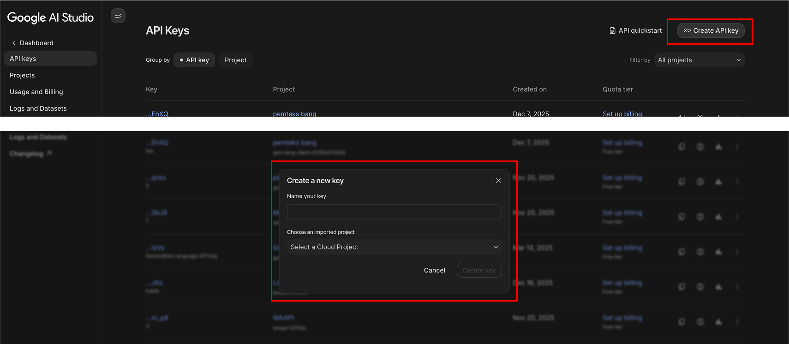

### Langkah 6.2: Konfigurasi Script
Buka file `03. Labeling/process.py` dan sesuaikan konfigurasi:

```python
# API Keys (bisa lebih dari satu untuk menghindari rate limit)
API_KEYS = [
    "API_KEY_1",
    "API_KEY_2",  # Opsional
]

# Jumlah worker threads (sesuaikan dengan jumlah API Key)
NUM_WORKERS = 50

# File paths
INPUT_FILE = "newdata-5.csv"        # File input
OUTPUT_FILE = "newdata-5-out.csv"   # File output

# Persentase data yang akan dilabeli (0.0 - 1.0)
LABELING_PERCENTAGE = 1.0  # 1.0 = 100% data
```

### Langkah 6.3: Menyiapkan File Input
Pastikan file input CSV memiliki kolom `text` yang berisi teks komentar yang sudah melalui pra-pemrosesan.

### Langkah 6.4: Menjalankan Script
```bash
cd "03. Labeling"
python process.py
```

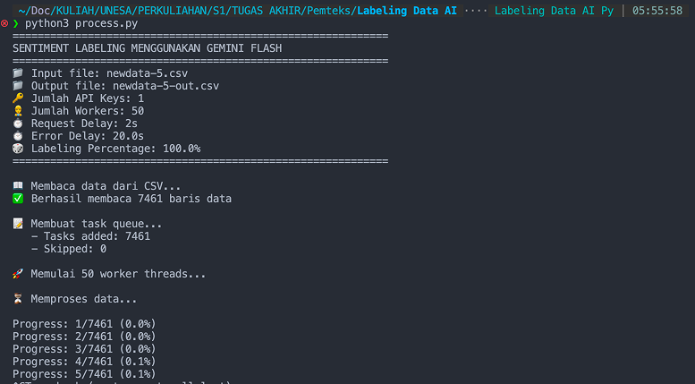

### Langkah 6.5: Hasil Output
File output akan memiliki kolom tambahan `sentiment` dengan nilai:
- `positive`: Sentimen positif
- `netral`: Sentimen netral
- `negative`: Sentimen negatif

### Langkah 6.6: Statistik Hasil
Setelah proses selesai, script akan menampilkan statistik:

```
STATISTIK HASIL LABELING
Positive: 2500 (33.5%)
Netral: 3000 (40.2%)
Negative: 1961 (26.3%)
SELESAI!
```

---

## 7. Modul 4: Pelatihan Model

Modul ini melakukan pelatihan model klasifikasi sentimen menggunakan SBERT dan SVM.

### Langkah 7.1: Membuka Notebook
Buka file `04. Training Model/[Pemteks]_Analisis_Sentiment.ipynb` menggunakan:
- Google Colab (disarankan untuk akses GPU)
- Jupyter Notebook lokal

### Langkah 7.2: Alur Pelatihan Model

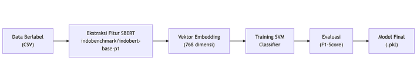

### Langkah 7.3: Menjalankan Pelatihan
1. Upload file data berlabel ke notebook
2. Jalankan sel-sel secara berurutan:
   - Instalasi library
   - Import dan load data
   - Ekstraksi fitur dengan SBERT (indobenchmark/indobert-base-p1)
   - Split data training dan testing
   - Training model SVM
   - Evaluasi performa

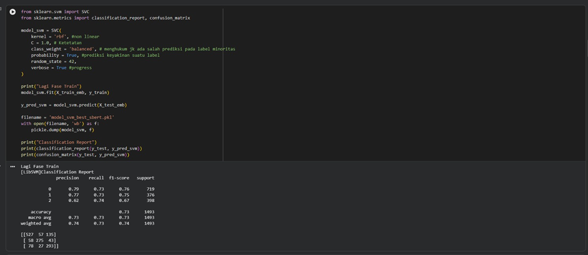

### Langkah 7.4: Hasil Evaluasi
Notebook akan menampilkan metrik evaluasi:
- **Accuracy**: Akurasi keseluruhan
- **Precision**: Ketepatan prediksi per kelas
- **Recall**: Cakupan prediksi per kelas
- **F1-Score**: Harmonic mean precision dan recall

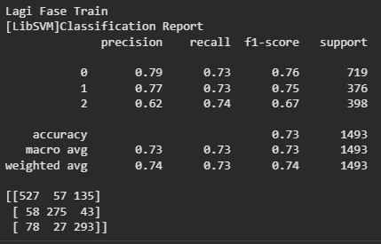

### Langkah 7.5: Menyimpan Model
Model yang telah dilatih akan disimpan dalam format `.pkl` untuk digunakan pada tahap implementasi.

---

## 8. Modul 5: Dasbor Interaktif

Modul ini menyajikan hasil analisis melalui antarmuka web interaktif.

### Langkah 8.1: Persiapan Data
Pastikan file `data_dashboard_final.csv` tersedia di folder `05. Implementasi Dasbor/static/`.

File CSV untuk dashboard harus memiliki kolom-kolom berikut:

| Kolom | Deskripsi | Contoh |
|-------|-----------|--------|
| `username` | Nama pengguna | `CryptoFan123` |
| `text` | Teks komentar asli | `bitcoin turun lagi nih` |
| `created_at` | Tanggal dan waktu posting | `2025-01-29 14:49:37+00:00` |
| `sumber` | Sumber data | `X` atau `Youtube` |
| `sentiment` | Label sentimen | `positive`, `netral`, atau `negative` |
| `month` | Bulan (numerik) | `1.0` |
| `label_code` | Kode numerik sentimen | `0` (netral), `1` (positive), `2` (negative) |
| `text_stopwords` | Teks setelah stopword removal | `bitcoin turun lagi` |

### Langkah 8.2: Menjalankan Server
```bash
cd "05. Implementasi Dasbor"
python server.py
```

Output yang diharapkan:
```
INFO:     Started server process [12345]
INFO:     Waiting for application startup.
INFO:     Application startup complete.
INFO:     Uvicorn running on http://0.0.0.0:8001 (Press CTRL+C to quit)
```

### Langkah 8.3: Mengakses Dasbor
Buka browser dan akses alamat:
```
http://localhost:8001
```

**Live Demo**: Dasbor juga dapat diakses secara online di:
```
https://pemteks.mytugas.web.id
```

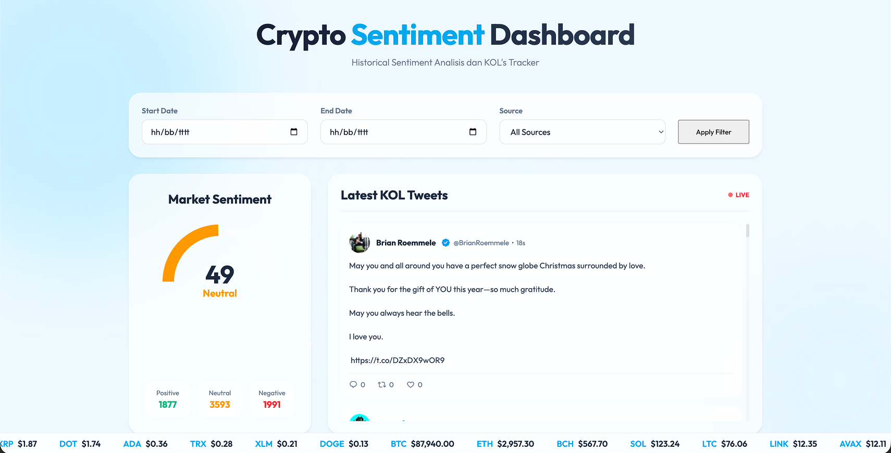

### Langkah 8.4: Fitur-Fitur Dasbor

#### 8.4.1 Filter Data
Gunakan panel filter di bagian atas untuk menyaring data berdasarkan:
- **Start Date & End Date**: Rentang tanggal
- **Source**: Sumber data (All, X, YouTube)

Klik tombol **Apply Filter** untuk menerapkan filter.

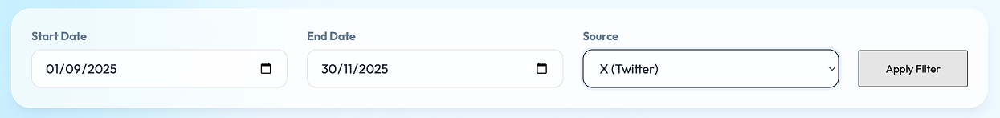

#### 8.4.2 Market Sentiment Gauge
Menampilkan indikator sentimen pasar secara visual dengan:
- Gauge meter dengan skala warna (merah - kuning - hijau)
- Jumlah data per kategori sentimen

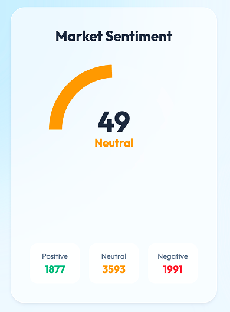

#### 8.4.3 Latest KOL Tweets
Menampilkan tweet terbaru dari Key Opinion Leaders (KOL) kripto secara real-time.

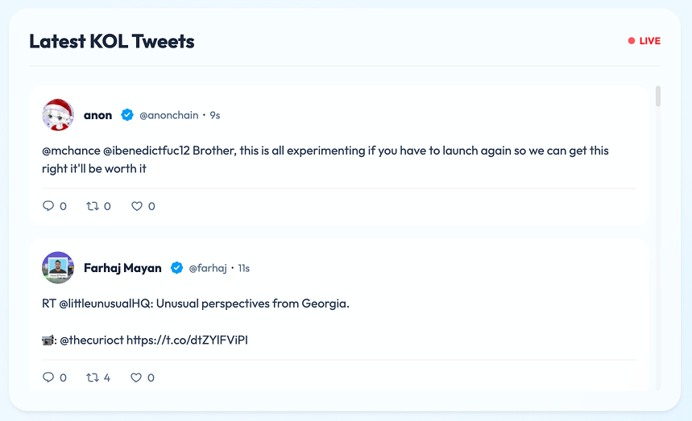

#### 8.4.4 Word Cloud & N-gram Analysis
Visualisasi kata-kata yang sering muncul untuk setiap kategori sentimen:
- **Word Cloud**: Representasi visual ukuran kata berdasarkan frekuensi
- **N-gram Frequency**: Grafik batang frekuensi n-gram

Gunakan input **N-gram Size** untuk mengubah ukuran n-gram (1=Unigram, 2=Bigram, dst).

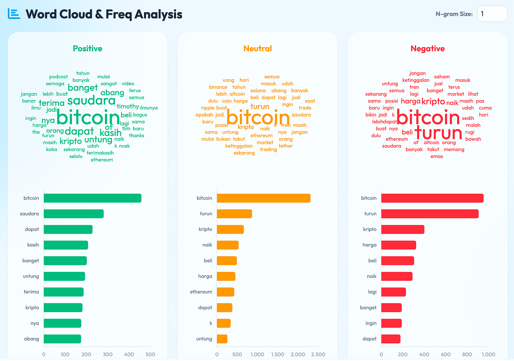

#### 8.4.5 Fitur Samples
Klik pada bar grafik n-gram untuk melihat contoh kalimat yang mengandung kata tersebut.

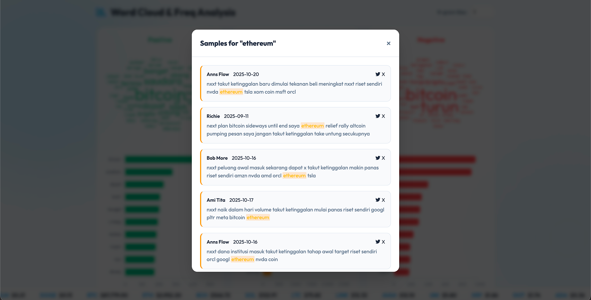

#### 8.4.6 Data Pasar Kripto
Bagian bawah dasbor menampilkan:
- **Latest News**: Berita kripto terbaru

- **Latest Articles**: Artikel kripto terbaru
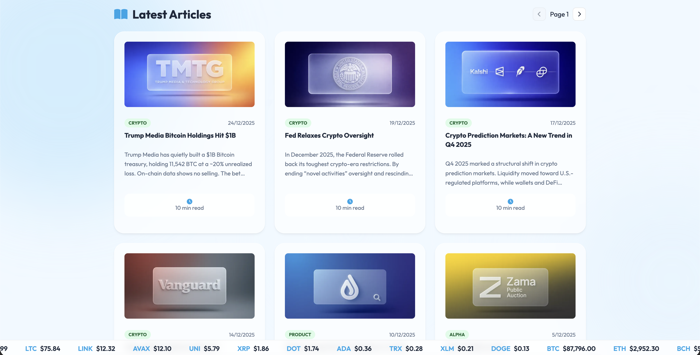
- **Upcoming Airdrops**: Informasi airdrop mendatang
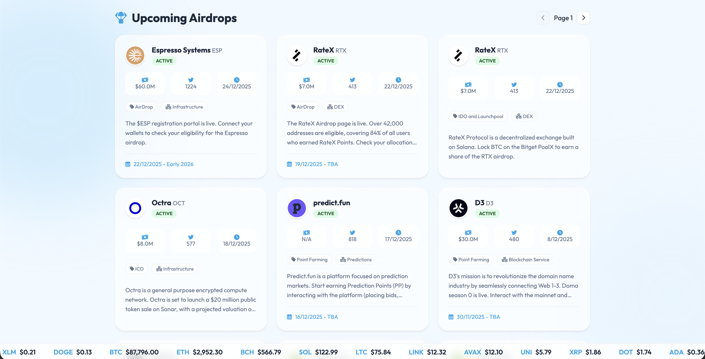
- **Token Unlocks**: Jadwal unlock token
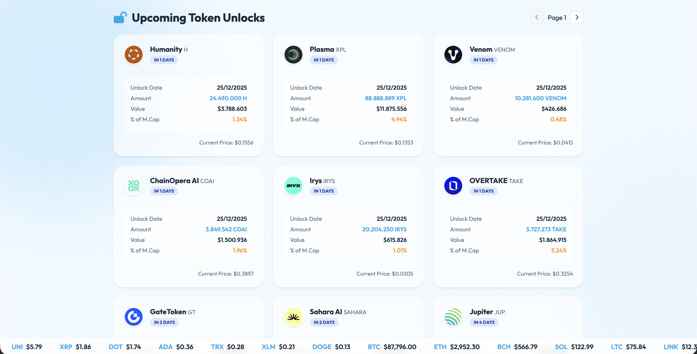
- **Price Ticker**: Harga kripto real-time (marquee)


### Langkah 8.5: Menghentikan Server
Tekan `CTRL + C` pada terminal untuk menghentikan server.

---

## 9. Pemecahan Masalah

### Masalah Umum dan Solusi

#### 9.1 Error saat Scraping X (Twitter)
| Error | Penyebab | Solusi |
|-------|----------|--------|
| `Login error` | Cookies kadaluarsa | Ambil ulang cookies dari browser |
| `Rate limit exceeded` | Terlalu banyak request | Kurangi `TWEET_PER_BULAN` atau tambah delay |
| `Account suspended` | Akun terdeteksi bot | Gunakan akun lain |

#### 9.2 Error saat Pelabelan dengan Gemini
| Error | Penyebab | Solusi |
|-------|----------|--------|
| `Resource exhausted` | Kuota API habis | Tunggu reset kuota atau tambah API key |
| `Invalid API key` | API key salah | Periksa kembali API key |
| `Connection error` | Masalah jaringan | Periksa koneksi internet |

#### 9.3 Error saat Menjalankan Dasbor
| Error | Penyebab | Solusi |
|-------|----------|--------|
| `Port already in use` | Port 8001 sudah digunakan | Ubah port di `server.py` atau matikan proses lain |
| `File not found` | Data CSV tidak ada | Pastikan file `data_dashboard_final.csv` tersedia |
| `Module not found` | Dependensi belum terinstal | Jalankan `pip install -r requirements.txt` |

#### 9.4 Performa Model Rendah
- Tambahkan lebih banyak data training
- Lakukan hyperparameter tuning pada SVM
- Periksa kualitas pelabelan data

---

## Kontak dan Dukungan

**Repositori GitHub**: https://github.com/alfathir27/pemteks-final-project

Jika mengalami kendala yang tidak tercantum di atas, silakan hubungi:

| Nama | Email | Peran |
|------|-------|-------|
| Bagus Arya Dwipangga | bagusaryadwipangga1105@gmail.com | Anggota Tim |
| M. Habiburrohman Al-Fathir | me@alfathir.id | Anggota Tim |
| Muhammad Habib Nur Aiman | muhammadhabibna@gmail.com | Anggota Tim |

---

## 10. Lisensi

Proyek ini dilisensikan di bawah **MIT License**.

```
Copyright (c) 2025 Kelompok 3 Pemteks 2024B UNESA

Permission is hereby granted, free of charge, to any person obtaining a copy
of this software and associated documentation files (the "Software"), to deal
in the Software without restriction, including without limitation the rights
to use, copy, modify, merge, publish, distribute, sublicense, and/or sell
copies of the Software, and to permit persons to whom the Software is
furnished to do so, subject to the following conditions:

The above copyright notice and this permission notice shall be included in all
copies or substantial portions of the Software.

THE SOFTWARE IS PROVIDED "AS IS", WITHOUT WARRANTY OF ANY KIND, EXPRESS OR
IMPLIED, INCLUDING BUT NOT LIMITED TO THE WARRANTIES OF MERCHANTABILITY,
FITNESS FOR A PARTICULAR PURPOSE AND NONINFRINGEMENT. IN NO EVENT SHALL THE
AUTHORS OR COPYRIGHT HOLDERS BE LIABLE FOR ANY CLAIM, DAMAGES OR OTHER
LIABILITY, WHETHER IN AN ACTION OF CONTRACT, TORT OR OTHERWISE, ARISING FROM,
OUT OF OR IN CONNECTION WITH THE SOFTWARE OR THE USE OR OTHER DEALINGS IN THE
SOFTWARE.
```

---

**Versi Dokumen**: 1.0  
**Terakhir Diperbarui**: Desember 2025
